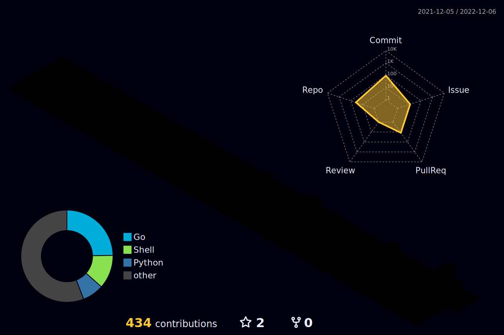

### Welcome

### My blog
[Croak: lodatang.com](https://lodatang.com)
Fork from [Next.js Notion Starter Kit](https://github.com/transitive-bullshit/nextjs-notion-starter-kit)

  

### Commonly used tools

  
 
  
  
  
  
 
  
  
  
 
   
  
  
  
  
  
  
  
  
  
  
  
  
  

  

### Summary_cards with dracula

 
 

### Github stats

### Contribution

### Contribution-snake

### Contribution-3d

